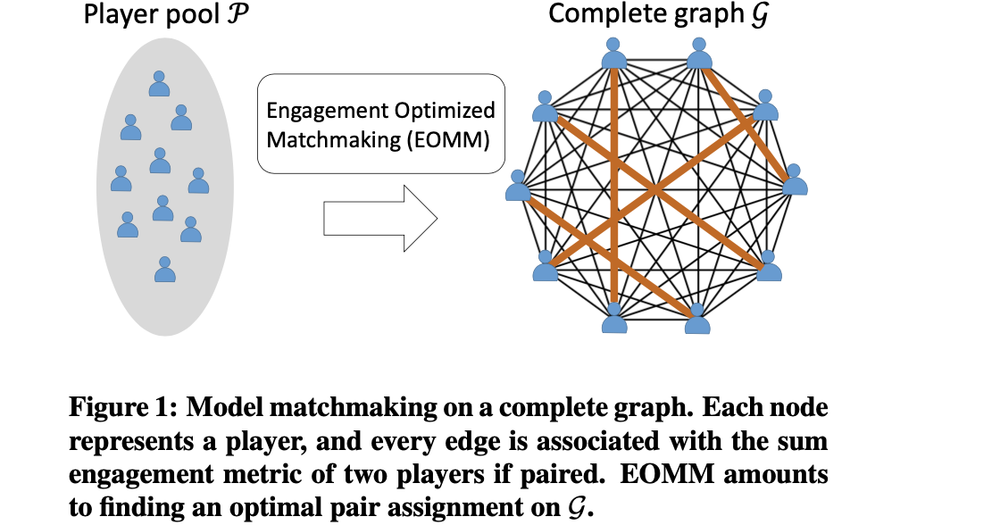

# About this repo
**This is a toy reproduction of the paper**  [*(WWW'17) EOMM: An Engagement Optimized Matchmaking*](http://web.cs.ucla.edu/~yzsun/papers/WWW17Chen_EOMM).

We are research engineers working on game matchmaking optimization domain. The idea of EOMM paper is interesting, so we reproduced the framework and the matchmaking procedure, according to the description in the paper.

# 1. RUN THE CODE

### - First tryout

```shell
$ cd EOMM
$ pip install -r requirements.txt  # use pip3 if you have both python2 and python3 in your environment
$ python main.py  # log file will be generated into ./log folder
```
You can see the simulation result both from your console and log file in `./log` folder.

### - Code files

```shell
EOMM
├── EOMM.py                   # the matchmakers, including WorstMM, SkillMM, RandomMM, EOMM
├── Matchmaking_simulator.py  # the matchmaking simulator
├── main.py                   # the main process to run a simulation
├── log                       # folder to keep log files
```

### - Customize your matchmaking simulation

In the file `main.py`, you can edit the variables 

- matchmakers: the matchmakers to compare in the simulation
- round_num: the round of matchmaking simulation for a given player_num
- player_num: the size of waiting pool of player for simulation

An example: 

```python
round_num=10000, player_num=100
matchmakers = [RandomMM(), SkillMM(), WorstMM(), EOMM()]
```

1. At each round, we create a pool of 100 players;

2. The matchmakers (RandomMM, SkillMM, WorstMM, EOMM) apply on these 100 players; we calculate the retain players of each matchmaker as its performance;
3. We take the average retain of the 10000 matchmaking rounds as the performance of the matchmaker on 100 players

**Now you can play around with the codes.**

# 2. Summary of EOMM algorithm

Argument: the intuitive assumption that a fair game is best player experience sometimes fails, and matchmaking based on fairness is not optimal for engagement. 

Goal: maximize overall player engagement

**EOMM:**

- first measures players disengagement by their churn risk after each matchmaking decision;

- secondly models all players who wait in the matchmaking pool as a complete graph, where each player is a node and the edge between two players is their sum churn risks if paired;

- achieven matchmaking desicion by solving a *minimum weight perfect matching* problem that finds non-overlapping pairs with the minimal sum of edge weights on a complete graph.

  

Limits: it applies to 1-vs-1 matches only.


# 3. Graph Matching implementation

The graph matching problem is sovled by ***networkx*** (see  [max_weight_matching](https://networkx.org/documentation/stable/reference/algorithms/generated/networkx.algorithms.matching.max_weight_matching.html?highlight=max_weight#networkx.algorithms.matching.max_weight_matching) for more details).

- For the ease of graph matching, churn/retain rate values are in percentage (*100%)

- WorstMM (minimize the engagement) is to maximize the total churn weight(i.e. churn rate of p<sub>i</sub> + churn weight of p<sub>j</sub>) of the paired nodes
- EOMM is transformed into max weight matching on the retain weight (i.e. 200-churn weight)